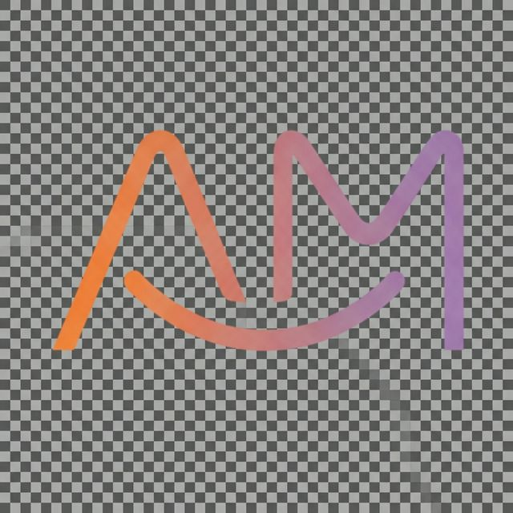

# Анастасия Маркова — Врач-ортодонт | Персональный сайт

Современный, эстетичный и функциональный сайт для Анастасии Марковой — врача-ортодонта, спикера и преподавателя РУДН.



## 🌟 Особенности

- **Современный дизайн**: Минимализм, "стеклянный" (glassmorphism) эффект, плавная анимация.
- **Технологический стек**: Next.js 14, React, Tailwind CSS, Framer Motion, Lucide React.
- **Адаптивность**: Полная поддержка мобильных устройств, планшетов и десктопов.
- **Производительность**: Оптимизированные изображения, ленивая загрузка, SEO-оптимизация.

## 🛠 Технологии

- **Framework**: [Next.js 14](https://nextjs.org/) (App Router)
- **Styling**: [Tailwind CSS](https://tailwindcss.com/)
- **Animation**: [Framer Motion](https://www.framer.com/motion/)
- **Icons**: [Lucide React](https://lucide.dev/)
- **Fonts**: Inter, Playfair Display (Google Fonts)

## 🚀 Запуск проекта

### Требования
- Node.js 18+
- npm или yarn

### Установка

```bash
# Клонировать репозиторий
git clone https://github.com/arrgav/amarkova-website.git

# Перейти в директорию
cd amarkova-website

# Установить зависимости
npm install
# или
yarn install
```

### Запуск в режиме разработки

```bash
npm run dev
# или
yarn dev
```
Откройте [http://localhost:3000](http://localhost:3000) в браузере.

### Сборка для продакшена

```bash
npm run build
npm run start
# или
yarn build
yarn start
```

## 📂 Структура проекта

- `app/` — Страницы и макеты (App Router)
- `components/` — Переиспользуемые UI компоненты
  - `ui/` — Базовые элементы интерфейса (Button, Input и т.д.)
- `public/` — Статические файлы (изображения, иконки)
- `lib/` — Утилиты и вспомогательные функции

## 📝 Лицензия

Этот проект является частной собственностью. Копирование и распространение без разрешения запрещено.
